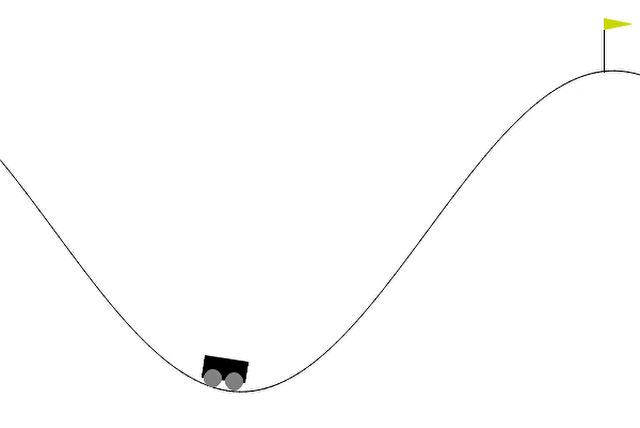

# OOP Project - Group 18

## 👥 Group Members

| Name | Student ID |
|------|------------|
| **陳聖繹** | B123040037 |
| **余家睿** | B123040040 |
| **陳偉財** | B123040061 |

---

## 📋 Project Overview

This project demonstrates the application of **Object-Oriented Programming (OOP)** principles in Reinforcement Learning by implementing three classic control problems using **Gymnasium**.

### **Main Objective: Inverted Pendulum Control**
Our primary focus is solving the **Inverted Pendulum** problem. We transformed the continuous Pendulum-v1 environment into a discrete state-action space suitable for **tabular Q-Learning**, demonstrating how OOP principles can help structure complex RL tasks.

### **Implementations**
- **Part 1**: Mountain Car - Classic RL benchmark
- **Part 2**: Frozen Lake - Hyperparameter tuning with Optuna
- **Part 3**: Pendulum (Main Project) - Custom OOP implementation

---

## 🎯 Quick Start

### **Main Project: Pendulum Agent**

```bash
# Navigate to part3 directory
cd part3

# Train the agent
python train_pendulum.py --train --episodes 2000

# Evaluate with visualization
python train_pendulum.py --render --episodes 10
```

---

## 📦 Installation & Setup

### **1. Setup Virtual Environment**
```bash
# Create virtual environment
python -m venv .venv

# Activate (Windows)
.venv\Scripts\activate

# Activate (macOS/Linux)
source .venv/bin/activate
```

### **2. Install Gymnasium**
```bash
cd Gymnasium
pip install -e .
cd ..
```

### **3. Install Dependencies**
```bash
pip install "gymnasium[classic_control]"
pip install matplotlib optuna tqdm
```

---

## 🚀 Running Each Part

### **Part 1: Mountain Car** 🏔️
- **Description**: Agent learns to build momentum to reach the goal.
- **Goal**: Verify that the Gymnasium environment and required dependencies are correctly installed and functioning.
```bash
cd part1
# Train
python mountain_car.py --train --episodes 5000
# Test
python mountain_car.py --render --episodes 10
```

**Demonstration**:


---

### **Part 2: Frozen Lake** ❄️
- **Description**: Navigate a frozen lake to reach the goal while avoiding holes. 
- **Goal**: Demonstrate **Hyperparameter Tuning** (Optuna), **Reward Shaping**, and **Two-phase Training** strategies to achieve a stable success rate > 70%.

```bash
cd part2
# Hyperparameter tuning
python frozen_lake.py --tune
# Train using best parameters
python frozen_lake.py --train
# Evaluate with render
python frozen_lake.py --eval --render
```

**Demonstration**:


---

### **Part 3: Pendulum (Main Project)** 🎯
- **Description**: Custom OOP implementation for discrete tabular Q-Learning.
- **Goal**: Train an agent to swing up and balance the pendulum in an upright position.

```bash
cd part3
# Full training
python train_pendulum.py --train --episodes 2000
# Evaluation
python train_pendulum.py --render --episodes 10
```


**Demonstration**:


---

## 📚 Dependencies

| Package | Version | Purpose |
|---------|---------|---------|
| **gymnasium** | 1.2.2 | RL environment framework |
| **numpy** | 2.2.0 | Numerical computations |
| **matplotlib** | 3.10.0 | Visualization and plotting |
| **pygame** | 2.6.1 | Rendering |
| **optuna** | 4.1.0 | Hyperparameter tuning (Part 2) |
| **tqdm** | 4.66.5 | Progress bar |

---

## 🎓 OOP Concepts Demonstrated (Part 3)

In Part 3, we applied core OOP properties to structure our code:

- **Encapsulation**: The `PendulumAgent` class hides the complex mathematics of state discretization. Users interact with simple methods (`reset`, `perform_action`) without needing to know the internal conversion logic.
- **Inheritance**: `PendulumEnv` inherits from `gym.Env`. This allows our custom environment to be used by any Gymnasium-compatible tool seamlessly.
- **Polymorphism**: Our agent can switch between different behaviors (exploration vs. exploitation) using the same interface methods.
- **Abstraction**: We used abstract base classes to define clear templates for our Agents and Strategies, separating the definition of behavior from its implementation.
- **Composition**: Our `PendulumEnv` operates by containing a `PendulumAgent` instance rather than putting all logic in one class. This modular approach makes specific components easier to replace or test.
- See [UML diagram](./part3/UML_diagram.png) for detailed Class diagrams.
---

## 👨‍💻 Contribution List

| Member | Responsibilities |
|--------|------------------|
| **陳聖繹** | `pendulum_env.py`: Gym wrapper & interface compliance<br/>`UML Diagram`|
| **余家睿** | `pendulum_agent.py`: Discretization logic & action mapping<br/>`Demo slides`|
| **陳偉財** | `train_pendulum.py`: Q-Learning algorithm & training loop <br/>`Reflection Report` |

---

